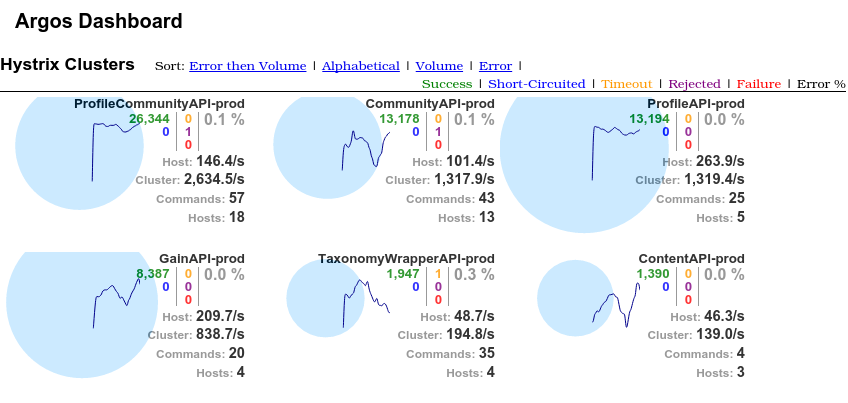

## Argos Dashboard

Argos Dashboard provides a real-time holistic view of multiple Hystrix clusters by aggregating data for each 
cluster onto a single dashboard. This is different than the [Hystrix Dashboard](https://github.com/Netflix/Hystrix/wiki/Dashboard)
which shows Hystrix command metrics for a single cluster or host. Argos Dashboard connects to the Turbine stream for each
cluster and aggregates the metrics for all the Hystrix commands running on that cluster. The information shown for each cluster 
is the same as the Hystrix Dashboard with two exceptions: each metric is the aggregate of all commands on that cluster 
and the error percentage is the **average** error percentage of all the commands. This prevents a healthy high frequency 
command from drowning out a failing low frequency command. 



## Running

1. Download the tarball for the [latest release](https://github.com/bbcom/argos-dashboard/releases/latest).
2. Edit the files in the `config` subdirectory as needed.
3. Start the dashboard `java -jar bin/argos-dashboard.war`
4. The dashboard will run on the port specified in the config (ex http://127.0.0.1:9000)

## Configuration

Argos Dashboard needs to know about the Turbine streams for each cluster. The `ClusterDiscovery` interface returns each 
cluster and it's corresponding Turbine stream. The implementation of `ClusterDiscovery` used can be changed via the 
`discovery.impl` property. You can implement your own `ClusterDiscovery` or use one of the provided implementations. 

Standard [spring-boot](http://docs.spring.io/spring-boot/docs/current/reference/html/howto-logging.html) and 
[logback](http://logback.qos.ch/manual/configuration.html) configuration can be used for logging.
 
## Provided ClusterDiscovery Implementations

### ClusterListDiscovery

`ClusterListDiscovery` will connect to Turbine servers and automatically monitor each cluster configured on that server.
This is accomplished by connecting to the [ClusterListServlet](https://github.com/bbcom/turbine-plugins/wiki#clusterlistservlet)
from the Bodybuilding.com Turbine Plugins library. `ClusterListServlet` is configured automatically if you use the 
[Hystrix / Turbine Quickstart](https://github.com/bbcom/hystrix-dashboard-quickstart) which is intended to be a drop in 
replacement for Turbine. This implementation needs to know the URL(s) of the `ClusterListServlet` which is set via the property file:
```
discovery:
    impl: com.bodybuilding.argos.discovery.ClusterListDiscovery
    
turbine:
    clusterlist:
        servers:
            - http://server1/turbine/clusterlist
            - http://server2/turbine/clusterlist
```

### ConfigurationClusterDiscovery

`ConfigurationClusterDiscovery` takes a list of Hystrix clusters and the corresponding Turbine URL:

```
discovery:
    impl: com.bodybuilding.argos.discovery.ClusterListDiscovery

turbine:
  servers:
    - 'cluster1|http://turbine/turbine/turbine.stream?cluster=cluster1'
    - 'cluster2|http://turbine/turbine/turbine.stream?cluster=cluster2'
```

The format for each cluster is `<cluster name>|<turbine URL>`.

## Bugs and Feedback

For bugs, questions and discussions please use the [Github Issues](https://github.com/bbcom/argos-dashboard/issues).

## Build

* You need Java 8 or later and Maven 3.

To build:

```
$ git clone https://github.com/bbcom/argos-dashboard.git
$ cd argos-dashboard/
$ mvn package
```


## LICENSE

Copyright 2015 Bodybuilding.com

Licensed under the Apache License, Version 2.0 (the "License");
you may not use this file except in compliance with the License.
You may obtain a copy of the License at

<http://www.apache.org/licenses/LICENSE-2.0>

Unless required by applicable law or agreed to in writing, software
distributed under the License is distributed on an "AS IS" BASIS,
WITHOUT WARRANTIES OR CONDITIONS OF ANY KIND, either express or implied.
See the License for the specific language governing permissions and
limitations under the License.
